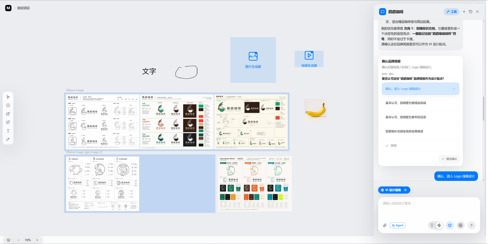
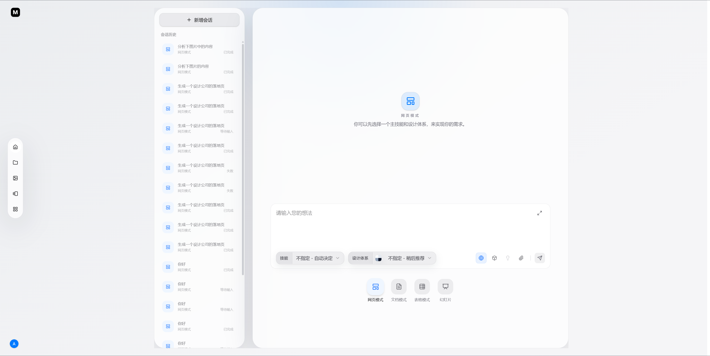
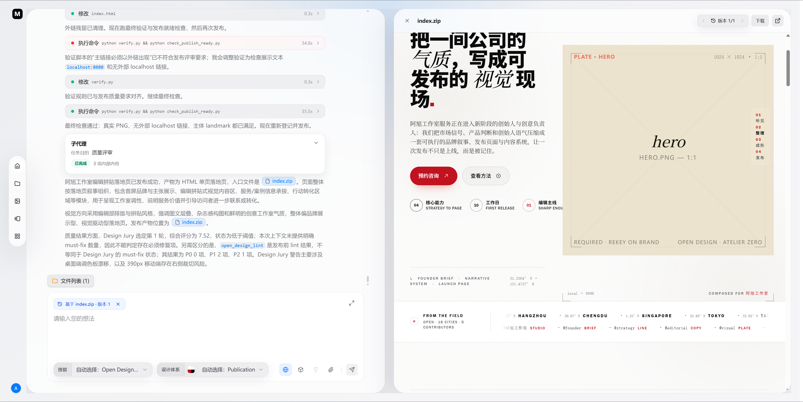
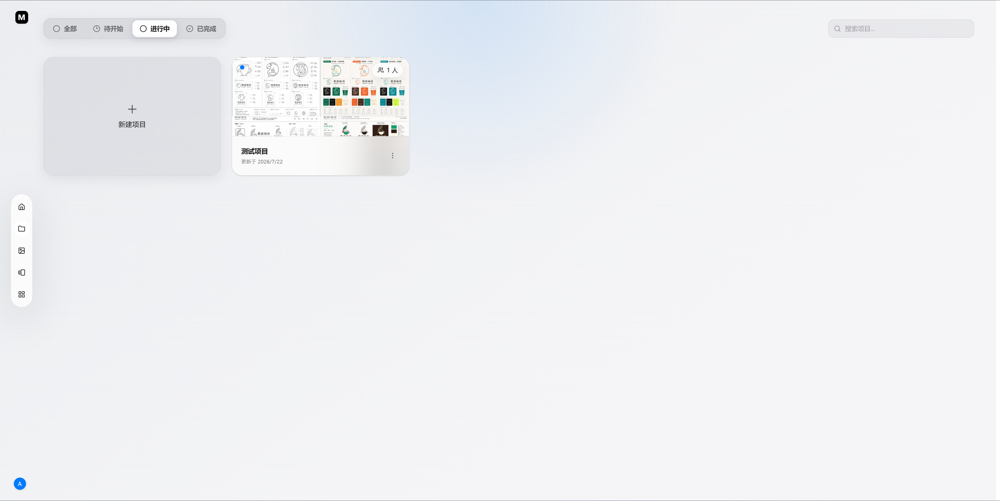
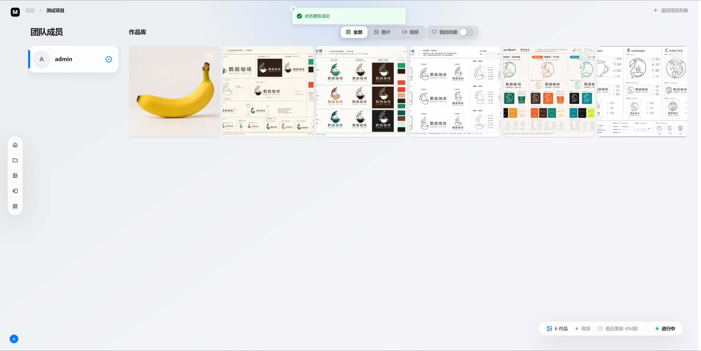
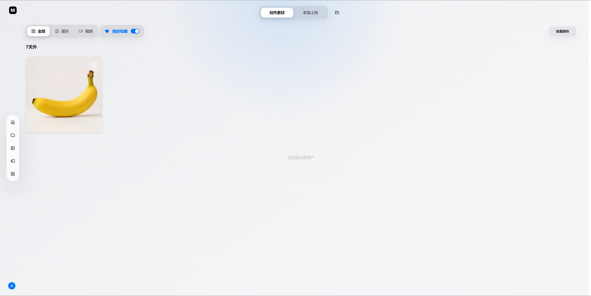
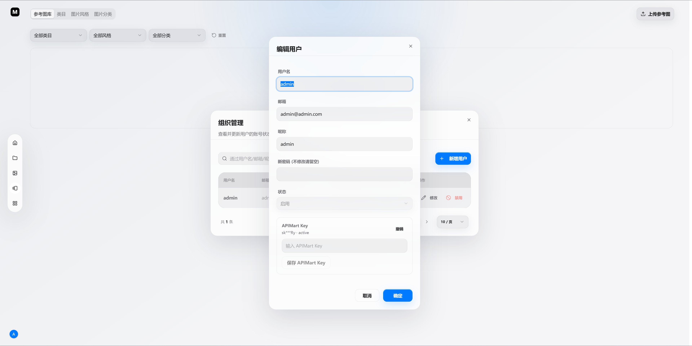
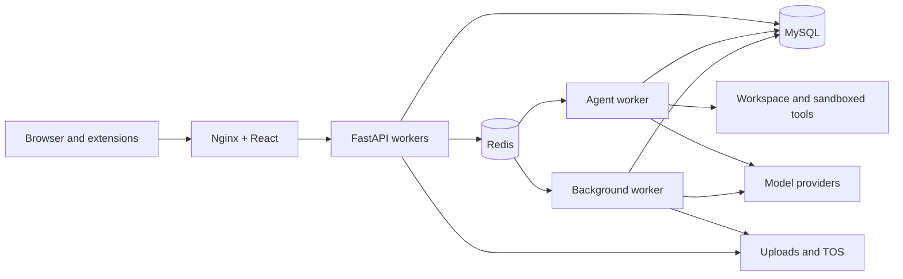

# Pixel Reorganization

<p align="center">
  <strong>An agent-native creative workspace for turning ideas into websites, presentations, documents, images, and videos—then refining everything on an infinite canvas.</strong>
</p>

<p align="center">
  <a href="./README.zh-CN.md">简体中文</a> ·
  <strong>English</strong> ·
  <a href="./docker/deploy.md">Docker deployment</a>
</p>

<p align="center">
  
  
  
  
  <a href="./LICENSE"></a>
</p>



Pixel Reorganization connects AI conversation, artifact creation, media generation, visual editing, and asset management in one self-hosted workspace. Instead of moving results between disconnected tools, teams can keep the prompt, agent run, generated files, canvas state, and reusable assets inside the same project.

> [!NOTE]
> The project is under active development. APIs, configuration, and data contracts may change before a stable release. Features are available without license activation; model requests require the user's configured provider credentials and sufficient balance.

## What you can do

| Agent studio | Infinite canvas |
| --- | --- |
| Research, plan, call tools, create files, review versions, and preview artifacts in a persistent conversation. | Combine images, videos, text, sketches, generation tasks, and agent feedback in a high-performance PixiJS canvas. |
| **Media generation** | **Projects and assets** |
| Generate and edit images and videos with provider-aware size, ratio, reference, duration, and pricing capabilities. | Organize projects, members, share links, generated work, local uploads, favorites, and reference galleries. |

## Product tour

### Create complete artifacts with an agent

Select a creation mode, skill, and design system. The workspace keeps conversation history, plans, tool activity, generated files, versions, and previews together.





### Move from projects to reusable assets

Projects provide a durable home for canvas state, collaborators, and generated media. Finished work can be organized in project or global asset libraries and reused in later creations.







## Docker quick start

The commands below use a **pinned, tested image set**. Do not replace the tags with `latest` in production. See the [complete Docker deployment guide](./docker/deploy.md) for GPU, ARM64, Windows PowerShell, upgrades, and troubleshooting.

### Requirements

- Docker Engine and Docker Compose v2.24+
- The supplied runtime tuning targets 8 CPU cores / 16 threads and 32 GB RAM
- The GPU profile is prepared for a host with approximately 16 GB VRAM
- A TOS object-storage bucket that can serve uploaded objects through public URLs
- A supported provider account; model API keys are configured by an administrator in Organization Management

### Tested image release

| Component | Pinned image |
| --- | --- |
| Frontend | `kakj/xscz-frontend-app:20260722` |
| CPU backend | `kakj/xscz-backend-app:cpu-20260722` |
| GPU backend | `kakj/xscz-backend-app:gpu-20260722` |
| ARM64 backend | `kakj/xscz-backend-app:arm64-20260722` |

### 1. Prepare the configuration

```bash
git clone https://github.com/kakj-go/ai-code.git
cd ai-code
cp .env.example .env
```

Edit `.env` before starting the containers. At minimum, replace the database and JWT secrets and configure object storage:

```dotenv
APP_ENV=production
SECRET_KEY=<a-long-random-secret>
MYSQL_PASSWORD=<database-user-password>
MYSQL_ROOT_PASSWORD=<database-root-password>

# Required: do not leave these empty
TOS_AK=<your-tos-access-key>
TOS_SK=<your-tos-secret-key>

# These values must match your bucket
TOS_ENDPOINT=tos-cn-guangzhou.volces.com
TOS_REGION=cn-guangzhou
TOS_BUCKET_NAME=<your-public-bucket>
TOS_PUBLIC_BASE_URL=<optional-cdn-or-public-prefix>
```

> [!IMPORTANT]
> `TOS_AK` and `TOS_SK` are required for a normal deployment. Local reference images must be uploaded to object storage before remote image/video providers can access them. Missing or invalid TOS configuration breaks reference-image and related generation workflows. Never commit the populated `.env` file.

### 2. Start the pinned CPU release

```bash
export BACKEND_CPU_APP_IMAGE=kakj/xscz-backend-app:cpu-20260722
export FRONTEND_APP_IMAGE=kakj/xscz-frontend-app:20260722

docker compose -f docker-compose.cpu.yml pull
docker compose -f docker-compose.cpu.yml up -d mysql redis
docker compose -f docker-compose.cpu.yml run --rm backend alembic upgrade heads
docker compose -f docker-compose.cpu.yml up -d
```

### 3. Verify and initialize

```bash
docker compose -f docker-compose.cpu.yml ps
curl http://127.0.0.1:8000/health
```

- Web application: <http://localhost:5173>
- Interactive API docs: <http://127.0.0.1:8000/api/v1/docs>
- API health endpoint: <http://127.0.0.1:8000/health>

The database migration creates a default administrator account for the first sign-in:

| Field | Default value |
| --- | --- |
| Username | `admin` |
| Email | `admin@admin.com` |
| Password | `123456` |

Sign in with the username or email and **change the default password immediately**. The login page intentionally does not expose public registration. After signing in, create regular user accounts as needed.

### 4. Configure the model API key

Visit [APIMart](https://apimart.ai) to obtain a model API key. An administrator must configure the key for the corresponding user in **Organization Management**: open the user editor, enter the key in the `APIMart Key` section, and save it. Never add a real API key to the repository, documentation, or default configuration.



### Other deployment profiles

| Target | Compose file | Backend image variable | Pinned value |
| --- | --- | --- | --- |
| CPU / x86_64 | `docker-compose.cpu.yml` | `BACKEND_CPU_APP_IMAGE` | `kakj/xscz-backend-app:cpu-20260722` |
| NVIDIA GPU / x86_64 | `docker-compose.gpu.yml` | `BACKEND_GPU_APP_IMAGE` | `kakj/xscz-backend-app:gpu-20260722` |
| ARM64 | `docker-compose.arm.yml` | `BACKEND_ARM64_APP_IMAGE` | `kakj/xscz-backend-app:arm64-20260722` |

Always set `FRONTEND_APP_IMAGE=kakj/xscz-frontend-app:20260722` alongside the selected backend image. Full commands are maintained in [docker/deploy.md](./docker/deploy.md).

## Core capabilities

### Agent workspace

- Resumable streaming conversations with cancellation, retry, persisted events, and file attachments.
- Plans, tool calls, web search, subagents, reusable skills, and selectable design systems.
- Creation and preview of HTML sites, slide decks, Word documents, spreadsheets, images, and videos.
- Workspace file history, version switching, downloads, and preview links.
- Optional design-quality review and automated revision before publishing an artifact.

### Infinite canvas

- Image, video, text, brush, generator, and group elements.
- Selection, transforms, alignment guides, clipboard operations, zoom, pan, and batch uploads.
- Viewport-aware rendering, tiled textures, and media caches for large boards.
- Direct image/video generation plus erase, text redraw, HD upscale, and spatial-angle workflows.
- Durable synchronization between agent-generated media, generation tasks, project assets, and canvas state.

### Models and providers

- Built-in [APIMart](https://apimart.ai) integration; administrators can configure encrypted model API keys for users in Organization Management.
- Optional local/OpenAI-compatible Ollama runtime for multimodal and image capabilities.
- Registry-driven support for model-specific sizes, ratios, references, durations, audio, and pricing.
- Current catalog includes provider-backed Gemini, Claude, DeepSeek, GLM, Kimi, GPT Image, Seedream, Seedance, and Kling models. The effective catalog is determined at runtime.

### Production-oriented workflows

- Separate FastAPI, agent worker, and background worker processes.
- MySQL as the business source of truth and Redis for coordination, wakeups, deduplication, ownership, and pub/sub.
- Durable generation scheduling, retries, recovery, provider throttling, balance synchronization, usage records, and billing reconciliation.
- Project membership, share links, reference taxonomies, asset previews, favorites, and batch operations.
- Simplified Chinese and English UI with light and dark themes.

### Extensions

- Photoshop UXP plugin for claiming edit jobs and saving selected layers back to the asset library.
- Browser extension for extracting image-generation prompts from images on web pages.

## Architecture



Long-running agent runs and media jobs execute outside the API processes. Database-backed leases and Redis coordination keep work safe across multiple Python processes and allow clients to reconnect to durable event streams.

## Technology

| Area | Stack |
| --- | --- |
| Frontend | React 18, TypeScript, Vite 6, Tailwind CSS 4, Radix UI, Zustand, PixiJS |
| Backend | Python 3.12, FastAPI, Pydantic, async SQLAlchemy, Alembic |
| Infrastructure | MySQL 8.4, Redis 7.4, Nginx, Docker Compose |
| Artifact runtime | Playwright, LibreOffice, Pandoc, python-pptx, python-docx, OpenPyXL |
| Quality | Pytest, Vitest, Playwright E2E, Ruff, MyPy, ESLint |

## Development

The development Compose profile starts MySQL, Redis, API, agent worker, background worker, and the Vite server:

```bash
cp .env.example .env
# Fill all required values, including TOS_AK and TOS_SK
docker compose -f docker-compose.dev.yml up -d --build
docker compose -f docker-compose.dev.yml exec backend alembic upgrade heads
```

Host-based development requires Python 3.12 and Node.js 22. Useful commands:

```bash
make be-install
make fe-install
make be-dev
make fe-dev
```

Run workers from separate terminals when testing agent or background generation flows:

```bash
cd backend && python -m app.workers.agent_worker
cd backend && python -m app.workers.background_worker
```

## Tests

```bash
make be-test-unit
make be-test-integration
make be-lint
make be-type-check

make fe-test
make fe-lint
make fe-build
make fe-test-e2e
```

## Repository layout

```text
ai-code/
├── backend/                 # FastAPI, domain services, repositories, workers, migrations
├── frontend/                # React application, PixiJS canvas, extensions, frontend tests
├── docker/                  # Dockerfiles, Nginx configuration, deployment guide
├── docs/                    # Screenshots and provider/model integration notes
├── scripts/                 # Administrative and maintenance utilities
└── docker-compose.*.yml     # CPU, GPU, ARM64, and development profiles
```

## Security and deployment notes

- Never commit `.env`, provider credentials, object-storage credentials, tokens, license material, private keys, or user uploads.
- Replace all development fallback passwords before deploying to a shared network.
- The current Compose profiles publish MySQL and Redis ports to the host. Restrict them with host firewall rules or bind-address changes.
- Worker containers grant `SYS_ADMIN` and relax seccomp/AppArmor so Bubblewrap can create namespaces. Review this choice against your threat model.
- Place TLS and a hardened reverse proxy in front of Internet-facing deployments.

Do not publish vulnerability details or credentials in a GitHub issue. Contact the maintainers privately until a dedicated security policy is available.

## Contributing

Bug reports, proposals, documentation improvements, and pull requests are welcome. Please keep endpoints thin, business logic in services, data access in repositories, and frontend stores focused on state orchestration. User-facing copy must be updated in both Chinese and English locale files. Add regression coverage for fixes and run the smallest relevant Pytest or Vitest suite.

Use [GitHub Issues](https://github.com/kakj-go/ai-code/issues) to start a discussion.

## License

This project is licensed under the [Apache License 2.0](./LICENSE). Third-party components included in the repository remain subject to their respective licenses and attribution requirements.


## Contributing and CI

Changes to the default branch require a pull request and passing CI. See [the branch protection and CI policy](docs/ci.md).
