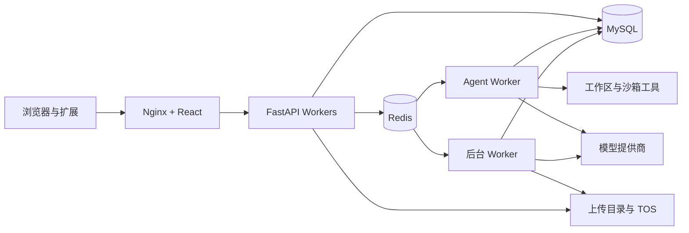

# 像素重组（Pixel Reorganization）

<p align="center">
  <strong>一个 Agent 原生的 AI 创作工作台：从想法出发生成网站、演示文稿、文档、图片与视频，再到无限画布中继续编辑和协作。</strong>
</p>

<p align="center">
  <strong>简体中文</strong> ·
  <a href="./README.md">English</a> ·
  <a href="./docker/deploy.md">Docker 部署</a>
</p>

<p align="center">
  
  
  
  
</p>


像素重组将 AI 对话、制品创作、媒体生成、视觉编辑和素材管理连接到一个可自托管的工作区。团队不再需要在多个割裂的工具之间搬运结果：Prompt、Agent Run、生成文件、画布状态和可复用素材都保留在同一个项目中。

> [!NOTE]
> 项目仍处于快速开发阶段，稳定版本发布前，API、配置项和数据合同可能变化。部分能力还取决于已配置的模型提供商和部署许可证版本。

## 你可以用它做什么

| Agent 创作工作台 | 无限画布 |
| --- | --- |
| 在持久化会话中完成调研、计划、工具执行、文件生成、版本检查与制品预览。 | 在高性能 PixiJS 画布中组合图片、视频、文字、草图、生成任务与 Agent 建议。 |
| **媒体生成** | **项目与素材** |
| 根据不同模型的尺寸、比例、参考图、时长和计费能力生成及编辑图片、视频。 | 管理项目、成员、分享链接、生成作品、本地上传、收藏和参考图库。 |

## 产品预览

### 通过 Agent 交付完整制品

选择创作模式、Skill 和设计系统。工作区会集中保存对话历史、计划、工具执行、生成文件、历史版本与实时预览。


### 从项目沉淀为可复用素材

项目为画布状态、协作者与生成媒体提供持久化空间。完成的作品可以整理到项目或全局素材库，并在后续创作中继续复用。


## Docker 快速部署

以下命令使用一组**经过验证且固定版本的镜像**。生产环境不要将标签替换为 `latest`。GPU、ARM64、Windows PowerShell、版本升级和故障排查请阅读[完整 Docker 部署指南](./docker/deploy.md)。

### 环境要求

- Docker Engine 与 Docker Compose v2.24+
- 当前运行参数按 8 核 / 16 线程、32 GB 内存进行配置
- GPU 部署配置面向约 16 GB 显存的主机
- 一个能够通过公网 URL 访问对象的 TOS Bucket
- 受支持的模型提供商账号；APIMart 凭证在登录后按用户配置

### 已验证镜像版本

| 组件 | 固定镜像 |
| --- | --- |
| 前端 | `kakj/xscz-frontend-app:20260713` |
| CPU 后端 | `kakj/xscz-backend-app:cpu-20260713` |
| GPU 后端 | `kakj/xscz-backend-app:gpu-20260713` |
| ARM64 后端 | `kakj/xscz-backend-app:arm64-20260713` |

### 1. 准备配置

```bash
git clone https://github.com/kakj-go/ai-code.git
cd ai-code
cp .env.example .env
```

启动容器前必须编辑 `.env`。至少替换数据库密码和 JWT 密钥，并配置对象存储：

```dotenv
APP_ENV=production
SECRET_KEY=<足够长的随机字符串>
MYSQL_PASSWORD=<数据库用户密码>
MYSQL_ROOT_PASSWORD=<数据库-root-密码>

# 必填：不能留空
TOS_AK=<你的-TOS-Access-Key>
TOS_SK=<你的-TOS-Secret-Key>

# 必须与实际 Bucket 保持一致
TOS_ENDPOINT=tos-cn-guangzhou.volces.com
TOS_REGION=cn-guangzhou
TOS_BUCKET_NAME=<你的公网-Bucket>
TOS_PUBLIC_BASE_URL=<可选的-CDN-或公网访问前缀>
```

> [!IMPORTANT]
> `TOS_AK` 和 `TOS_SK` 是正常部署的必填配置。本地参考图需要先上传至对象存储，远程图片/视频生成服务才能读取；TOS 配置缺失或无效会导致参考图及相关生成流程不可用。不要提交已经填写真实凭证的 `.env`。

### 2. 启动固定版本的 CPU 服务

```bash
export BACKEND_CPU_APP_IMAGE=kakj/xscz-backend-app:cpu-20260713
export FRONTEND_APP_IMAGE=kakj/xscz-frontend-app:20260713

docker compose -f docker-compose.cpu.yml pull
docker compose -f docker-compose.cpu.yml up -d mysql redis
docker compose -f docker-compose.cpu.yml run --rm backend alembic upgrade heads
docker compose -f docker-compose.cpu.yml up -d
```

### 3. 验证并初始化

```bash
docker compose -f docker-compose.cpu.yml ps
curl http://127.0.0.1:8000/health
```

- Web 应用：<http://localhost:5173>
- 交互式 API 文档：<http://127.0.0.1:8000/api/v1/docs>
- API 健康检查：<http://127.0.0.1:8000/health>

数据库迁移会创建一个用于首次登录的默认管理员账号：

| 字段 | 默认值 |
| --- | --- |
| 用户名 | `admin` |
| 邮箱 | `admin@admin.com` |
| 密码 | `123456` |

可使用用户名或邮箱登录，登录后**必须立即修改默认密码**。登录页有意不开放公开注册；进入系统后，请在应用设置中配置管理员的 APIMart Key，并按需创建普通用户账号。

### 其他部署架构

| 目标 | Compose 文件 | 后端镜像变量 | 固定值 |
| --- | --- | --- | --- |
| CPU / x86_64 | `docker-compose.cpu.yml` | `BACKEND_CPU_APP_IMAGE` | `kakj/xscz-backend-app:cpu-20260713` |
| NVIDIA GPU / x86_64 | `docker-compose.gpu.yml` | `BACKEND_GPU_APP_IMAGE` | `kakj/xscz-backend-app:gpu-20260713` |
| ARM64 | `docker-compose.arm.yml` | `BACKEND_ARM64_APP_IMAGE` | `kakj/xscz-backend-app:arm64-20260713` |

选择后端镜像时，必须同时设置 `FRONTEND_APP_IMAGE=kakj/xscz-frontend-app:20260713`。完整命令维护在 [docker/deploy.md](./docker/deploy.md) 中。

## 核心能力

### Agent 工作台

- 支持断线恢复、用户取消、重试、事件持久化和文件附件的流式会话。
- 支持计划、工具调用、Web 搜索、子 Agent、可复用 Skills 和可选设计系统。
- 可创建并预览 HTML 网站、演示文稿、Word 文档、表格、图片和视频。
- 提供工作区文件历史、版本切换、下载和预览链接。
- 可选的设计质量评审与发布前自动修订流程。

### 无限画布

- 支持图片、视频、文字、画笔、生成器和分组元素。
- 支持选择、变换、对齐辅助线、剪贴板、缩放、平移和批量上传。
- 通过视口感知渲染、分块纹理与媒体缓存支持大型画布。
- 直接进行图片/视频生成，以及擦除、文字重绘、高清放大和空间角度生成。
- 在 Agent 生成媒体、生成任务、项目素材与画布状态之间进行持久化同步。

### 模型与提供商

- 内置 APIMart 接入，并按用户加密存储凭证。
- 可选的本地/OpenAI 兼容 Ollama 运行时，支持多模态和图片能力。
- 通过能力注册表管理不同模型的尺寸、比例、参考图、时长、音频与计费参数。
- 当前目录涵盖由提供商支持的 Gemini、Claude、DeepSeek、GLM、Kimi、GPT Image、Seedream、Seedance 和 Kling 模型；最终目录由运行时配置决定。

### 面向生产的工作流

- 将 FastAPI、Agent Worker 和后台 Worker 拆分为独立进程。
- MySQL 保存业务事实，Redis 负责协调、唤醒、去重、所有权和发布订阅。
- 支持生成任务持久化调度、重试、恢复、提供商限流、余额同步、用量记录和计费对账。
- 支持项目成员、分享链接、参考图库分类、素材预览、收藏和批量操作。
- 提供简体中文与英文界面，以及亮色和暗色主题。

### 扩展

- Photoshop UXP 插件：领取编辑任务，并将选中图层保存回素材库。
- 浏览器扩展：从网页图片中提取可用于图片生成的提示词。

## 系统架构



耗时较长的 Agent Run 和媒体任务不会占用 API 进程。数据库租约与 Redis 协调机制保证多 Python 进程之间的任务安全，并允许客户端重新连接到持久化事件流。

## 技术栈

| 领域 | 技术 |
| --- | --- |
| 前端 | React 18、TypeScript、Vite 6、Tailwind CSS 4、Radix UI、Zustand、PixiJS |
| 后端 | Python 3.12、FastAPI、Pydantic、异步 SQLAlchemy、Alembic |
| 基础设施 | MySQL 8.4、Redis 7.4、Nginx、Docker Compose |
| 制品运行时 | Playwright、LibreOffice、Pandoc、python-pptx、python-docx、OpenPyXL |
| 质量保障 | Pytest、Vitest、Playwright E2E、Ruff、MyPy、ESLint |

## 开发

开发 Compose 配置会同时启动 MySQL、Redis、API、Agent Worker、后台 Worker 和 Vite 开发服务器：

```bash
cp .env.example .env
# 填写所有必填配置，包括 TOS_AK 和 TOS_SK
docker compose -f docker-compose.dev.yml up -d --build
docker compose -f docker-compose.dev.yml exec backend alembic upgrade heads
```

在宿主机开发需要 Python 3.12 和 Node.js 22，常用命令如下：

```bash
make be-install
make fe-install
make be-dev
make fe-dev
```

测试 Agent 或后台生成流程时，需要在独立终端启动 Worker：

```bash
cd backend && python -m app.workers.agent_worker
cd backend && python -m app.workers.background_worker
```

## 测试

```bash
make be-test-unit
make be-test-integration
make be-lint
make be-type-check

make fe-test
make fe-lint
make fe-build
make fe-test-e2e
```

## 仓库结构

```text
ai-code/
├── backend/                 # FastAPI、领域 Service、Repository、Worker 与数据库迁移
├── frontend/                # React 应用、PixiJS 画布、扩展与前端测试
├── docker/                  # Dockerfile、Nginx 配置与部署指南
├── docs/                    # 功能截图、提供商和模型接入资料
├── scripts/                 # 管理与维护工具
└── docker-compose.*.yml     # CPU、GPU、ARM64 与开发配置
```

## 安全与部署说明

- 不要提交 `.env`、提供商凭证、对象存储凭证、Token、许可证材料、私钥或用户上传内容。
- 部署到共享网络前，必须替换全部开发回退密码。
- 当前 Compose 配置会向宿主机发布 MySQL 和 Redis 端口，请通过防火墙或监听地址限制访问。
- 为让 Bubblewrap 创建 Namespace，Worker 容器授予了 `SYS_ADMIN`，并放宽 seccomp/AppArmor；请根据自身威胁模型进行审查。
- 面向公网部署时，请在应用前增加 TLS 和经过加固的反向代理。

请勿在 GitHub Issue 中公开漏洞细节或任何凭证。在项目提供专门的安全策略前，请私下联系维护者。

## 参与贡献

欢迎提交缺陷、提案、文档改进和 Pull Request。请保持 Endpoint 轻量，将业务逻辑放入 Service、数据访问放入 Repository，并让前端 Store 聚焦状态编排。修改用户可见文案时必须同步更新中英文 Locale。修复缺陷时请补充回归测试，并运行最小相关的 Pytest 或 Vitest 测试集。

通过 [GitHub Issues](https://github.com/kakj-go/ai-code/issues) 发起讨论。

## 许可证

仓库当前尚未包含 `LICENSE` 文件。在维护者正式添加许可证前，本项目未授予任何开源许可。将项目作为开源软件公开发布前，请选择并添加一份 OSI 批准的许可证。
